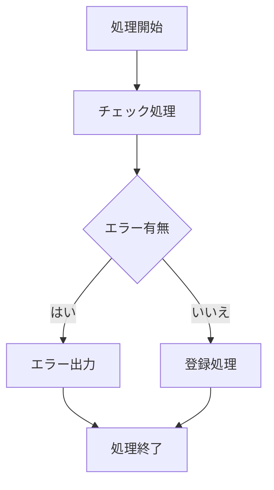

# 📄 3. Markdown の記法：応用編  

## 表（Table）

### 書き方
```
| 見出し1 | 見出し2 |
|--------|--------|
| 内容A  | 内容B  |
| 内容C  | 内容D  |
```

### 表示例

| 見出し1 | 見出し2 |
|--------|--------|
| 内容A  | 内容B  |
| 内容C  | 内容D  |

---

## ハイライト

### 書き方
```
重要なのは<mark>学び続けること</mark>です。
```

### 表示例
重要なのは<mark>学び続けること</mark>です。

---

## 文字色

### 書き方
Markdownでは文字色を変えることはできないのでHTMLタグを使用する。
```
表示する内容は<span style="color:red;">ユーザID</span>です。
```

### 表示例
表示する内容は<span style="color:red;">ユーザID</span>です。

---

---

## チェックボックス

### 書き方
初期値を入れておくこともできるが、実際にチェックできるかは閲覧ソフトによる。
Hugoだとダメ(別の方法はありそう？)
```
- [x] テストケース1
- [ ] テストケース2
- [ ] テストケース3
```

### 表示例
- [x] テストケース1
- [ ] テストケース2
- [ ] テストケース3

---

## フローチャート

### 書き方
Mermaid (マーメイド) 記法というJavaScriptベースのツール
を使用することでフローチャートを記載できる。  
```` ``` ````も記載必要。ちなみに、コードブロック内に```` ``` ````を書くには
`を４つで```` ``` ````を囲む。
````


````

### 表示例

---

## クラス図(UML)

### 書き方
PlantUMLを使用してテキスト記述からUML（Unified Modeling Language）図を自動生成
````
```uml
@startuml
class Car {
  - String model
  - int year
  + void start()
  + void stop()
}
class Driver {
  - String name
  + void drive(car)
}
Driver --> Car : drives
@enduml
```
````

### 表示例
PlantUMLの導入が必要なよう
現時点ではこのサイトでは対応していない